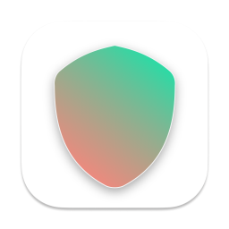

# NowConnect

NowConnect is a SwiftUI MenuBarExtra app that maintains Cisco Secure Client VPN account details and provides an interface for connection.

## How to save account details and connect to the VPN?

### Can't connect?
- Make sure the `Cisco Secure Client VPN` app is not running.
- Make sure `/opt/cisco/secureclient/bin/vpn` exists.
- Make sure `vpnagentd` is running in the **Activity Monitor**.
#### If your organization has groups:
Set up the Group Number in the NowConnect settings. Group numbers in the dropdown list of Cisco Secure Client increase from top to bottom, starting with Group 1 at the top.

In the example below: `UdS` would be Group **#5**

## How to delete account details?
- Go to NowConnect settings
- Enter your username
- Click "Delete all account details"

Alternatively, you can search `NowConnect` in **Keychain Access** app of your macOS device and delete them manually.

## Installation
- Download the latest .dmg file from the releases and drag the app icon into the Applications folder. Press **right-click > "Open"** to launch the app for the first time.

- Alternatively, you can run the project with Xcode.

## Things to keep in mind
**NowConnect** depends on the CLI of **Cisco Secure Client VPN**. If the CLI changes in any way, this app would break.

## Credits
[KeychainAccess](https://github.com/kishikawakatsumi/KeychainAccess)

